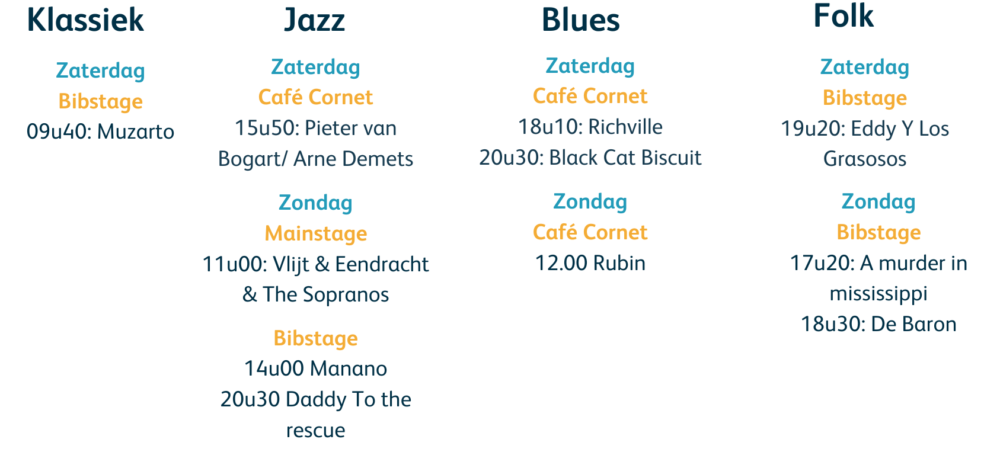
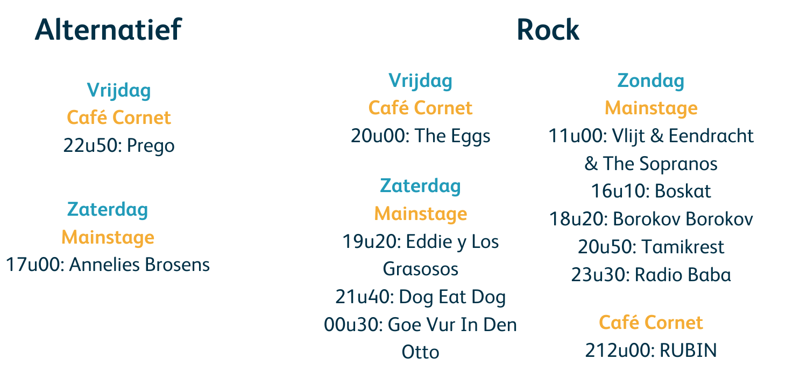
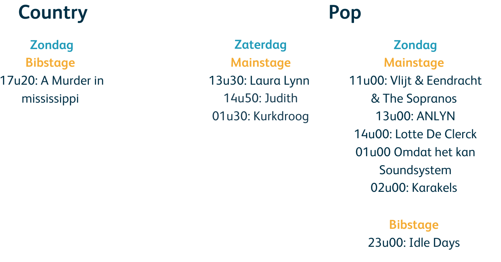
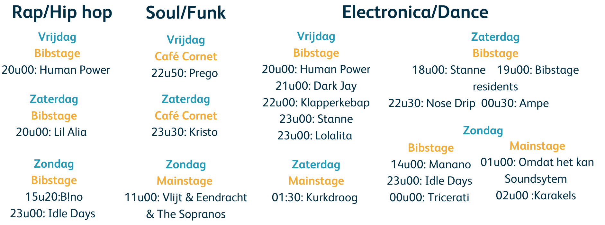

Festival Muziekaanbeveler voor de Straatfeesten Kalmthout

Dit project is een webapplicatie die gepersonaliseerde muziekaanbevelingen doet aan bezoekers van de Straatfeesten in Kalmthout. Op basis van een vragenlijst worden muzieksuggesties gegenereerd die passen bij je stemming, smaak en persoonlijkheid.

## Functionaliteiten

- Vragenlijst over stemming en muzieksmaak
- Analyse van antwoorden met aanbevelingslogica
- Gepersonaliseerde lijst met festivalacts en muziekgenres
- Overzichtelijke en gebruiksvriendelijke webinterface

## Gebruikte technologieën

**Frontend:**
- HTML / CSS / Javascript

**Backend:**
- Node.js + Express
- API’s voor communicatie tussen frontend en database

**Database:**
- SQLite / MySQL / MongoDB

**Aanbevelingslogica:**
- Regelgebaseerd systeem gebaseerd op muziekdimensies en persoonlijkheid (zie [HvA studie](https://www.hva.nl/binaries/content/assets/subsites/kc-fdmci/assets_1/boek-festivalbeleving---oktober-2012.pdf))

## Gebruikte libraries

| Doel            | Library/tool          |
|-----------------|------------------------|
| Server          | Express (Node.js)      |
| Database        | Sequelize / Mongoose   |
| Frontend logica | Axios (voor API calls) |
| Styling         | Bootstrap / Tailwind   |

## Externe Tools

- **Figma** (UI/Wireframe): [Link naar Figma ontwerp](https://www.figma.com/...)

## Achterliggend model
De aanbevelingen zijn gebaseerd op een vereenvoudigde versie van een persoonlijkheidsmodel dat muzieksmaak koppelt aan eigenschappen zoals: reflectief & complex, intense en rebels, upbeat en conventioneel & energiek.
Hierbij is de line up gekoppeld aan de verschillende genres & deze opgedeeld aan de verschillende personlijkheidstypes.

Reflective & Complex

Intense & Rebellious

Upbeat & Conventional

Energetic & Rhythmic

Gebaseerd op de HvA Studie: Festivalbeleving (2012)

# Types koppelen aan genres

| Persoonlijkheidstype           | Kenmerken      | Genres                               |
|--------------------------------|---------------------|--------------------------------------|
| Reflectief en Complex (a)      | Creatief, kalm, introspectief   | Ambient, Indie Folk, Jazz, Klassiek	 |
| Intens en Opstandig (b)        | Gedreven, avontuurlijk, rebels | Rock, Punk, Hip-Hop, Metal           |
| Opgewekt en Conversationeel (c) | Sociaal, gezellig, speels | Pop, Disco, Funk, Reggae             |
| Energiek en Ritmisch (d)        | Actief, expressief, levendig| Dance, EDM, Rap/hip hop                         |

# Technisch
1. Frontend
   Toon 1 vraag per keer met keuzerondjes (radio buttons)
   Bij klik op "volgende" → sla antwoord op in state
   Aan het einde: tel hoeveel keer a, b, c of d is gekozen
2. Logica

bv: function determinePersonalityType(answers) {
const counts = { a: 0, b: 0, c: 0, d: 0 };
answers.forEach(answer => counts[answer]++);
const dominant = Object.entries(counts).sort((a, b) => b[1] - a[1])[0][0];
return dominant; // 'a', 'b', 'c' of 'd'
}

3. Backend geeft genres en artiesten terug per type